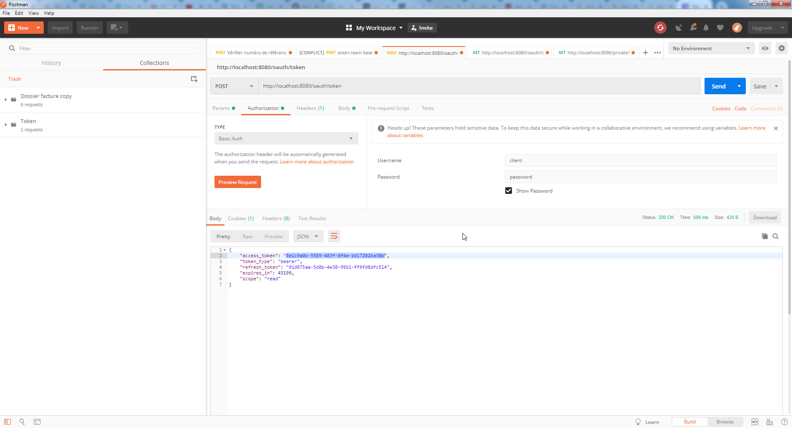
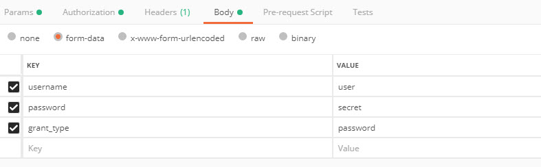
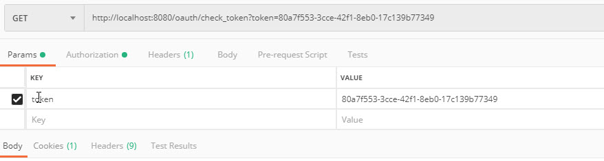

# Application
Serveur d'autorisation Oauth2 permettant d'obtenir un jeton access_token.
Ce serveur permet tester l'autorisation OAuth2, pour cela il faut au préalable s'authentifier avec un login / Mot de passe
- Login : user
- Mot de passe : secret

L'utilisateur a un rôle ADMIN 

Le serveur tourne sur le port 8080\
l'url est http://localhost:8080

# API REST
Utiliser le logiciel Postman pour pouvoir lancer des requetes POST

## Obtenir un token

http://localhost:8080/oauth/token

## Vérifier le token

http://localhost:8080/oauth/check_token?token=80a7f553-3cce-42f1-8eb0-17c139b77349

